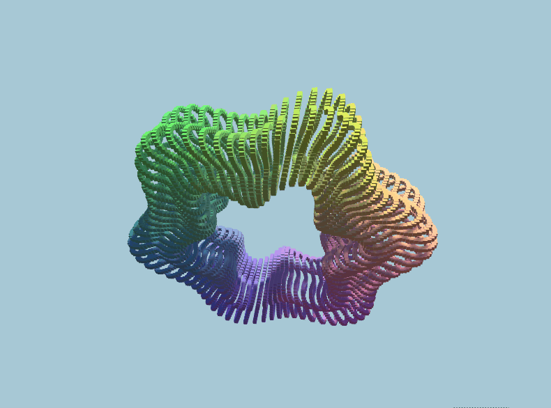

# Procedural Meshes and Math Fun

Some procedural meshes, deformations, maths graphs and others cool stuffs.
> Based on **[CatLikeCoding](http://catlikecoding.com/)**, **[Coding train](http://thecodingtrain.com/)** and **[Sebastian Lague](https://www.youtube.com/channel/UCmtyQOKKmrMVaKuRXz02jbQ)** tutorials

### 1. **[Maths graphs and some fractals](./MathFunctionGraph)**

### 2. **[Procedural Meshes and basic deformations](./MeshAndRendering)**

D:\Unity\Varios\Procedural-Meshes-and-Math-Fun\MeshAndRendering\.gitignore